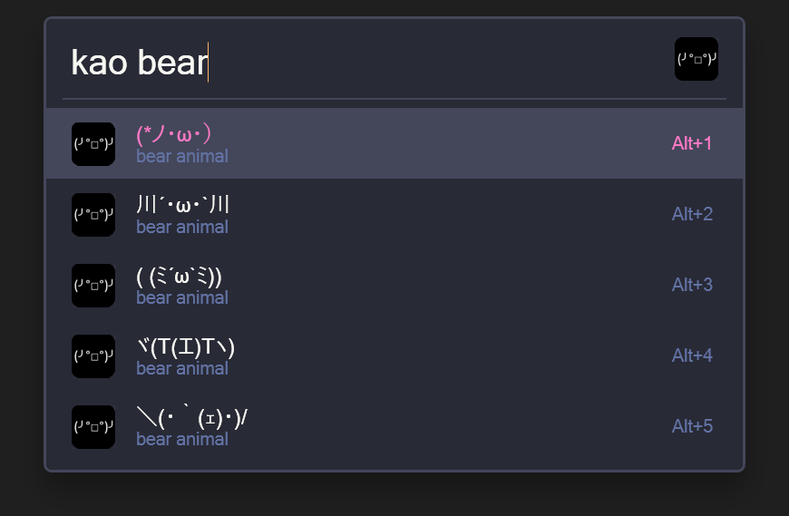

Flow.Launcher.Plugin.Kaomoji
==================

A plugin for [Flow launcher](https://github.com/Flow-Launcher/Flow.Launcher) that allows you to search for [kaomoji](https://en.wiktionary.org/wiki/kaomoji) and copy them to the clipboard.

### Usage

#### Installation 

`pm install Kaomoji`

#### Pattern 

`kao {query}`

#### Examples 

`kao table`
- `(╯°□°）╯︵ ┻━┻`, `table` flip
- `ʕノ•ᴥ•ʔノ ︵ ┻━┻`, bear animal flip `table`

`kao bear`
- `(*ノ・ω・）`, `bear` animal
- `ʕノ•ᴥ•ʔノ ︵ ┻━┻`, `bear` animal flip table

`kao bear table`
- `ʕノ•ᴥ•ʔノ ︵ ┻━┻`, `bear` animal flip `table`

### Links

- List of Kaomoji sourced from: https://github.com/jlmart88/kaomoji-slack